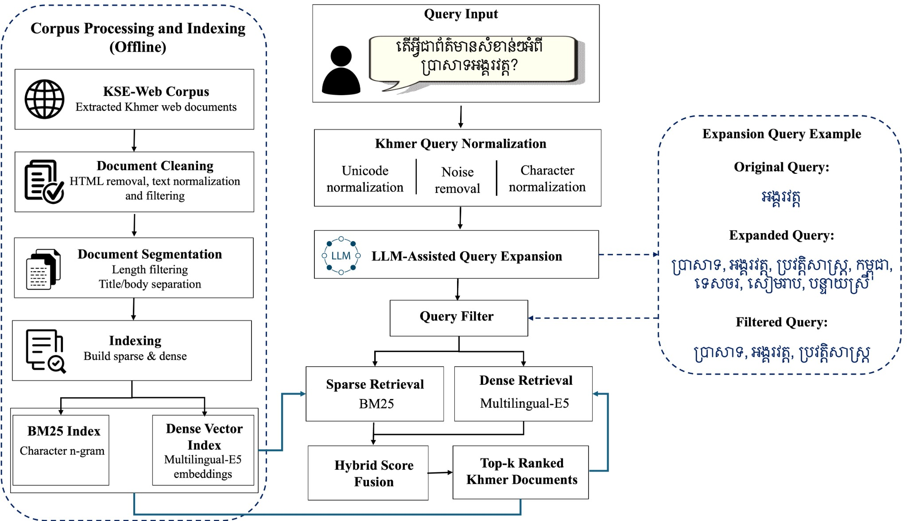
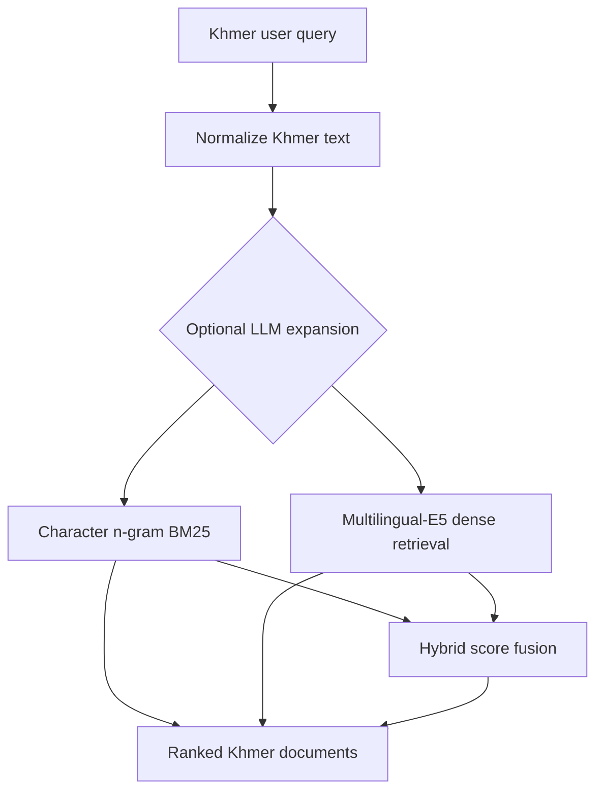
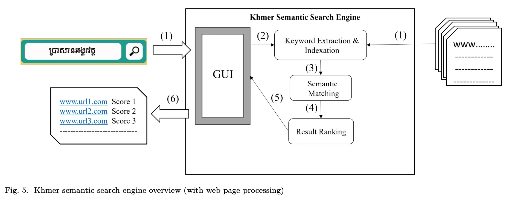

<h1 align="center">Khmer Semantic Search (KSE)</h1>

<p align="center">
  <strong>Research resources for Khmer information retrieval—from semantic keyword matching to hybrid and LLM-assisted web search.</strong>
</p>

<p align="center">
  <a href="https://hal.science/hal-05672989/"></a>
  <a href="https://hal.science/hal-05672989/"></a>
  <a href="https://huggingface.co/datasets/Backkh/KSE-Web3K"></a>
  <a href="LICENSE"></a>
</p>

<p align="center">
  <a href="#latest-paper-kse-web">Latest paper</a> ·
  <a href="#dataset-kse-web3k">Dataset</a> ·
  <a href="#quick-start">Quick start</a> ·
  <a href="#foundational-kse-work">Foundational work</a> ·
  <a href="#citation">Citation</a>
</p>

> [!IMPORTANT]
> **New paper — ICDAR 2026:** [KSE-Web: An Analysis of Hybrid Retrieval and LLM-Assisted Query Expansion for Low-Resource Khmer Semantic Search](https://hal.science/hal-05672989/) is available through the HAL open archive.

## Overview

Khmer Semantic Search (KSE) is a long-running research project focused on making Khmer digital information easier to retrieve, evaluate, and study. The project connects the original KSE framework—keyword extraction, semantic matching, ontology-based expansion, and ranking—with modern experiments in character-level sparse retrieval, multilingual dense retrieval, hybrid search, and LLM-assisted query expansion.

KSE is intended as:

- a **research foundation** for Khmer and low-resource information retrieval;
- an **educational resource** for students, researchers, and developers working on Khmer language technology; and
- a **reproducible baseline** for document retrieval, ranking, query expansion, and future retrieval-augmented systems.

This repository is a research and teaching resource rather than a production search service.

## Research evolution

| Period | Milestone | Focus |
|---|---|---|
| 2014–2016 | Initial KSE research and prototype | Khmer keyword extraction, semantic matching, ontology-based search, and document/URL ranking |
| 2024 | [Foundational KSE paper](https://arxiv.org/abs/2406.09320) released publicly | Digital information access and document retrieval for Khmer |
| 2026 | [KSE-Web paper](https://hal.science/hal-05672989/) and [KSE-Web3K](https://huggingface.co/datasets/Backkh/KSE-Web3K) | Sparse, dense, hybrid, and LLM-assisted Khmer web retrieval |

> [!NOTE]
> **Historical timeline:** the original KSE system and research were developed during **2014–2016**. The associated manuscript was made publicly available in **2024**; 2024 is the public-release year, not the beginning of the project.

## Latest paper: KSE-Web

**Nimol Thuon. “KSE-Web: An Analysis of Hybrid Retrieval and LLM-Assisted Query Expansion for Low-Resource Khmer Semantic Search.” International Conference on Document Analysis and Recognition (ICDAR 2026), Vienna, Austria.**

- **Paper:** [HAL record and open-access manuscript](https://hal.science/hal-05672989/)
- **Dataset:** [Backkh/KSE-Web3K on Hugging Face](https://huggingface.co/datasets/Backkh/KSE-Web3K)
- **HAL ID:** `hal-05672989`

### What the paper studies

KSE-Web examines whether modern retrieval methods transfer effectively to Khmer, where systems must handle ambiguous word boundaries, limited annotated data, mixed Khmer–English usage, spelling variation, named entities, and weaker representation in multilingual embedding models.

The study compares:

- character n-gram BM25 without Khmer word segmentation;
- dense retrieval with `multilingual-E5-small`;
- equal-weight BM25+dense score fusion;
- query expansion with Qwen2.5-0.5B-Instruct and Qwen2.5-3B-Instruct; and
- simple filtering of LLM-expanded queries.

### Main results

The following results are from the experimental snapshot reported in the paper. Higher is better.

| Retrieval method | Recall@10 | nDCG@10 | Main observation |
|---|---:|---:|---|
| Character n-gram BM25 | **0.943** | **0.876** | Strongest overall method |
| Hybrid BM25 + dense | 0.929 | 0.871 | Close to BM25, but does not surpass it |
| Dense (`multilingual-E5-small`) | 0.563 | 0.523 | Captures some semantic signal but remains substantially weaker |
| Hybrid + Qwen2.5-3B expansion | 0.868 | 0.788 | Best reported expanded hybrid variant, still below the original-query hybrid baseline |

The central finding is that **LLM query expansion should not be assumed to improve low-resource retrieval automatically**. The larger Qwen2.5-3B model produces more useful expansions than Qwen2.5-0.5B, but direct expansion can still introduce topic drift, generic terms, and noisy reformulations. Simple filtering can also remove useful semantic cues together with the noise.

## Retrieval framework

<p align="center">
  
</p>

<p align="center"><em>KSE-Web framework from the 2026 paper: offline corpus processing and indexing, optional LLM-assisted query expansion, sparse and dense retrieval, hybrid score fusion, and top-k Khmer document ranking.</em></p>

### Simplified retrieval pipeline

The following high-level view complements the detailed paper figure and makes the main retrieval flow easier to follow.



| Component | Role |
|---|---|
| Text normalization | Cleans Khmer text while preserving retrieval-relevant content |
| Character n-gram BM25 | Captures lexical overlap without depending on Khmer word segmentation |
| Dense retrieval | Uses multilingual embeddings and cosine similarity |
| Hybrid fusion | Combines normalized sparse and dense scores |
| LLM-assisted expansion | Adds retrieval-oriented terms while attempting to preserve the original intent |
| Evaluation | Reports Recall, Precision, MRR, and nDCG at cutoffs 5 and 10 |

## Dataset: KSE-Web3K

[KSE-Web3K](https://huggingface.co/datasets/Backkh/KSE-Web3K) is a silver-standard Khmer web retrieval resource designed for controlled sparse, dense, hybrid, reranking, and query-expansion experiments.

### Experimental snapshot reported in the paper

| Component | Description |
|---|---|
| Source pool | Approximately 17K candidate Khmer web titles |
| Document collection | 3,000 cleaned full-text Khmer web documents |
| Categories | Public service, education, tourism and culture, and general news/information |
| Queries | 300 manually reviewed user-style Khmer queries |
| Query styles | Short, question-style, informal, and mixed Khmer–English |
| Relevance judgments | 5,412 silver query–document labels with partial human verification |
| Relevance scale | `2` highly relevant, `1` partially relevant, `0` non-relevant |

> [!NOTE]
> These counts describe the experimental snapshot documented in the paper. As of August 2026, the public `qrels_silver_v2.csv` file contains 6,028 labeled rows, while the paper reports 5,412 labels for its experimental snapshot. Treat the hosted qrels as a distinct public release; scores produced by the quick-start workflow may therefore differ slightly from the manuscript results.

### Public files

| File | Contents |
|---|---|
| `data/documents.csv` | Document IDs, titles, cleaned text, categories, sources, URLs, and character counts |
| `data/documents.jsonl` | JSONL version of the document collection |
| `data/queries.csv` | Query text, query type, category, and source-document metadata |
| `data/qrels_silver_v2.csv` | Three-level silver relevance judgments linking queries and documents |

The files represent different retrieval entities and therefore use different schemas. Load the document, query, and relevance files separately rather than treating them as one table.

**Dataset license:** [CC BY-NC-ND 4.0](https://creativecommons.org/licenses/by-nc-nd/4.0/). Review the dataset terms before redistribution or adaptation.

## Repository contents

```text
Khmer-Semantic-Search/
├── codes/
│   ├── evaluate_retrieval.py   # BM25, dense, hybrid, and IR metrics
│   └── load_dataset.py         # Load, validate, inspect, and optionally export data
├── data/                       # Local dataset workspace (dataset hosted on Hugging Face)
├── LICENSE
└── README.md
```

The reference evaluator supports character 2–4-gram BM25, `multilingual-E5-small` dense retrieval, min–max hybrid score fusion, and Recall/Precision/MRR/nDCG evaluation at cutoffs 5 and 10.

## Quick start

### 1. Clone the repository

```bash
git clone https://github.com/back-kh/Khmer-Semantic-Search.git
cd Khmer-Semantic-Search
```

### 2. Install the lightweight dependencies

```bash
python -m pip install numpy pandas huggingface_hub
```

For dense or hybrid retrieval, also install:

```bash
python -m pip install sentence-transformers torch
```

### 3. Download KSE-Web3K

```bash
hf download Backkh/KSE-Web3K \
  --repo-type dataset \
  --local-dir data/kse-web3k
```

### 4. Prepare the script-compatible query and qrels files

The public dataset already provides `documents.jsonl`. The repository utilities currently expect queries in JSONL and qrels in TSV, so convert the two CSV files once:

```bash
python -c "import pandas as pd; from pathlib import Path; p=Path('data/kse-web3k/data'); pd.read_csv(p/'queries.csv').to_json(p/'queries.jsonl', orient='records', lines=True, force_ascii=False); pd.read_csv(p/'qrels_silver_v2.csv').to_csv(p/'qrels.tsv', sep='\t', index=False)"
```

### 5. Validate the dataset

```bash
python codes/load_dataset.py \
  --data_dir data/kse-web3k/data \
  --sample 3
```

### 6. Run the BM25 baseline

```bash
python codes/evaluate_retrieval.py \
  --documents data/kse-web3k/data/documents.jsonl \
  --queries data/kse-web3k/data/queries.jsonl \
  --qrels data/kse-web3k/data/qrels.tsv \
  --method bm25 \
  --output_dir results/bm25
```

To run dense or hybrid retrieval, change `--method` to `dense` or `hybrid`. The default dense model is `intfloat/multilingual-e5-small`, and the default hybrid fusion weight is `0.5` for BM25 and `0.5` for dense retrieval.

> [!TIP]
> The scripts are lightweight reference implementations. For the complete experimental protocol, prompts, analysis, and manuscript results, use the [KSE-Web paper](https://hal.science/hal-05672989/) as the authoritative reference.

## Foundational KSE work

### Khmer Semantic Search Engine (KSE): Digital Information Access and Document Retrieval

- **Paper:** [arXiv:2406.09320](https://arxiv.org/abs/2406.09320)
- **DOI:** [10.48550/arXiv.2406.09320](https://doi.org/10.48550/arXiv.2406.09320)
- **HAL:** [hal-04739808](https://hal.science/hal-04739808/)

The foundational KSE work presents a Khmer-specific framework for semantic document access. It covers keyword-dictionary matching, ontology-based expansion, weighted ranking, document and URL indexing, manual and automatic keyword extraction, and ground-truth preparation. This work established the project direction that KSE-Web later extends with modern retrieval baselines and LLM-assisted query processing.

<p align="center">
  
</p>

<p align="center"><em>Original KSE web-processing overview. The system was developed during 2014–2016 and documented in the manuscript publicly released in 2024.</em></p>

## Related resources

- **[KSWv2 Khmer Stop Word Dictionary](https://github.com/back-kh/KSWv2-Stop-Word-Dictionary-for-Khmer-Document):** Khmer stop-word resources and filtering examples for keyword extraction and retrieval.
- **[How Khmer Semantic Search Engine Works](https://ethanlazuk.com/blog/hamsterdam-research-kse/):** independent SEO and search-analysis article by Ethan Lazuk / Hamsterdam Research.

## Scope and limitations

- KSE-Web3K uses silver relevance judgments with partial human verification; it is not a final gold-standard benchmark.
- The candidate pool partly relies on BM25 retrieval, which may introduce lexical bias into the evaluation labels.
- The current collection focuses on web-extracted text and does not include PDFs, scanned pages, or OCR-derived documents.
- LLM-expansion results are specific to the tested models, prompts, decoding settings, and dataset snapshot.
- Stronger human-verified annotations, Khmer-aware retrieval models, and broader document sources remain important future directions.

## Citation

If you use KSE-Web or KSE-Web3K, please cite the ICDAR 2026 paper:

```bibtex
@inproceedings{thuon:hal-05672989,
  title        = {KSE-Web: An Analysis of Hybrid Retrieval and LLM-Assisted Query Expansion for Low-Resource Khmer Semantic Search},
  author       = {Thuon, Nimol},
  booktitle    = {International Conference on Document Analysis and Recognition},
  organization = {ICDAR 2026},
  address      = {Vienna, Austria},
  year         = {2026},
  month        = aug,
  url          = {https://hal.science/hal-05672989},
  hal_id       = {hal-05672989},
  hal_version  = {v1}
}
```

For the foundational KSE framework, cite:

```bibtex
@misc{thuon2024kse,
  title         = {Khmer Semantic Search Engine (KSE): Digital Information Access and Document Retrieval},
  author        = {Thuon, Nimol},
  year          = {2024},
  eprint        = {2406.09320},
  archivePrefix = {arXiv},
  primaryClass  = {cs.IR},
  doi           = {10.48550/arXiv.2406.09320},
  url           = {https://arxiv.org/abs/2406.09320}
}
```

## Licensing

The project components have separate licenses:

| Component | License |
|---|---|
| Repository code | [MIT License](LICENSE) |
| KSE-Web3K dataset | [CC BY-NC-ND 4.0](https://creativecommons.org/licenses/by-nc-nd/4.0/) |
| KSE-Web manuscript on HAL | [CC BY 4.0](https://creativecommons.org/licenses/by/4.0/) |

## Collaboration

Researchers, universities, students, and industry teams working on Khmer search, Khmer NLP, low-resource information retrieval, ranking, or human-verified dataset development are welcome to collaborate. Please open a GitHub issue or contact the project lead through the [Backkh GitHub profile](https://github.com/back-kh).

## Project lead

**Dr. Nimol Thuon**

<p align="center"><em>Advancing Khmer language technology and digital information access.</em></p>
